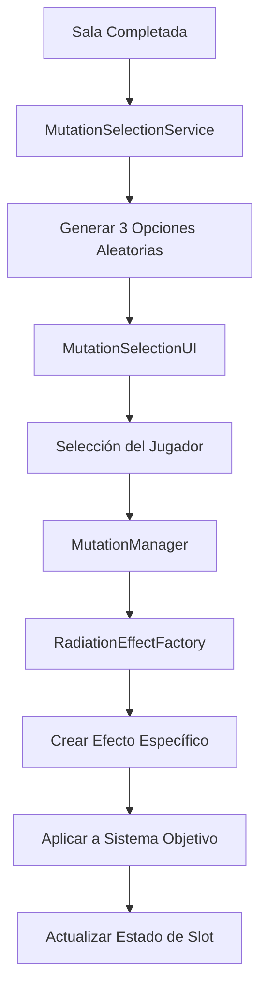

# **🧬 Arquitectura del Sistema de Mutaciones - ONNA**

**Versión:** v1.0.0
**Fecha:** 14 de Septiembre, 2025

---

## **📋 Resumen General**

Este documento describe la nueva arquitectura del sistema de mutaciones implementada para ONNA, siguiendo las especificaciones en `Sistema de Mutaciones – ONNA.md`. El sistema está construido con modularidad, escalabilidad y mantenibilidad en mente.

---

## **🏗️ Arquitectura Principal**

```
Mutations/
├── Core/
│   ├── RadiationEffect.cs           # Clase base abstracta para todos los efectos
│   ├── MutationSlot.cs              # Gestiona slots Mayor/Menor con niveles de mejora
│   ├── MutationSystem.cs            # Maneja sistemas corporales (3 total)
│   ├── MutationManager.cs           # Controlador principal singleton
│   ├── RadiationEffectFactory.cs    # Factory para crear efectos específicos
│   └── MutationSelectionService.cs  # Lógica de selección aleatoria
├── Effects/
│   ├── NervousSystem/
│   ├── IntegumentarySystem/
│   └── MuscularSystem/
├── UI/
│   └── MutationSelectionUI.cs       # Interfaz de selección
└── MutationsEnums.cs                # Enums principales
```

---

## **🔧 Componentes Principales**

### **RadiationEffect (Abstract Base)**
```csharp
public abstract class RadiationEffect : ScriptableObject
{
    // Identificación básica
    protected MutationType radiationType;
    protected SystemType systemType;
    protected SlotType slotType;

    // Datos del efecto
    protected string effectName;
    protected string description;
    protected Sprite icon;

    // Sistema de mejoras
    protected float baseValue;
    protected float upgradeMultiplier = 1.2f;
    protected int maxLevel = 4;

    // Métodos principales
    public abstract void ApplyEffect(GameObject player, int level = 1);
    public abstract void RemoveEffect(GameObject player);
    public virtual string GetDescriptionAtLevel(int level);
    public float GetValueAtLevel(int level);
}
```

### **MutationSlot**
- Gestiona slots individuales (Mayor/Menor)
- Rastrea tipo de radiación, nivel de mejora (1-4)
- Maneja aplicación/eliminación de efectos
- Valida asignaciones de radiación

### **MutationSystem**
- Representa sistemas corporales (Nervioso, Tegumentario, Muscular)
- Contiene 2 slots: Mayor + Menor
- Determina slot objetivo para nuevas radiaciones
- Gestiona lógica de asignación de slots

### **MutationManager (Singleton)**
- Controlador central para todo el sistema
- Gestiona 3 sistemas corporales
- Maneja referencia del jugador
- Coordina con factory y servicio de selección
- Limpia mutaciones al finalizar run

### **RadiationEffectFactory**
- Crea efectos específicos basados en radiación + sistema + slot
- Mantiene base de datos de efectos
- Proporciona herramientas de validación
- Soporta gestión de base de datos en editor

### **MutationSelectionService**
- Genera 3 opciones aleatorias de radiación
- Crea objetos MutationOption con descripciones
- Maneja lógica de selección y restricciones
- Gestiona posibilidades de mejora

---

## **📊 Flujo de Datos**



---

## **🎯 Enums y Tipos**

### **SystemType**
```csharp
public enum SystemType
{
    Nerve,          // Sistema Nervioso
    Integumentary,  // Sistema Tegumentario/Defensa
    Muscular        // Sistema Muscular/Movimiento
}
```

### **MutationType**
```csharp
public enum MutationType
{
    Gamma,      // Radiación de alta energía
    Alfa,       // Partículas alfa
    Beta,       // Partículas beta
    Neutrones,  // Radiación de neutrones (efectos de tiempo)
    Microondas, // Radiación de microondas (efectos de quemadura)
    Cherenkov   // Radiación Cherenkov (efectos de marcado)
}
```

### **SlotType**
```csharp
public enum SlotType
{
    Major,  // Primera radiación en sistema (efectos poderosos)
    Minor   // Segunda radiación en sistema (efectos de apoyo)
}
```

---

## **🔄 Lógica de Asignación de Slots**

1. **Sistema Vacío**: Primera radiación → Slot Mayor
2. **Mayor Ocupado**: Radiación diferente → Slot Menor
3. **Ambos Ocupados**: Misma radiación → Mejora (nivel +1, máx. 4)
4. **Radiación Diferente**: No se puede asignar (sistema lleno)

---

## **💡 Ejemplos de Efectos**

### **Gamma + Sistema Nervioso**
- **Mayor**: Aumenta curación de orbes pero incrementa drenaje de vida
- **Menor**: Atrae orbes de curación desde mayor distancia

### **Gamma + Sistema Tegumentario**
- **Mayor**: Aura de daño continuo alrededor del jugador
- **Menor**: Pulsos de daño periódicos

---

## **🎨 Integración de UI**

### **MutationSelectionUI**
- Muestra 3 opciones aleatorias después de completar sala
- Muestra tipo de radiación, sistema objetivo, descripción del efecto
- Muestra nivel de mejora para radiaciones existentes
- Pausa el juego durante la selección
- Maneja entrada del jugador y confirmación

---

## **🔒 Principios de Diseño**

### **Modularidad**
- Cada efecto es un ScriptableObject separado
- Patrón Factory para creación de efectos
- Clara separación de responsabilidades

### **Escalabilidad**
- Fácil agregar nuevos tipos de radiación
- Simple crear nuevos sistemas corporales
- Implementación directa de efectos

### **Mantenibilidad**
- Convenciones de nomenclatura consistentes
- Jerarquía de herencia clara
- Herramientas de validación en editor

### **Rendimiento**
- Efectos solo aplicados cuando se asignan
- Búsqueda eficiente a través de factory
- Mínimas asignaciones en runtime

---

## **🛠️ Guías de Implementación**

### **Creando Nuevos Efectos**
1. Heredar de `RadiationEffect`
2. Establecer radiación, sistema y tipo de slot en `Awake()`
3. Implementar `ApplyEffect()` y `RemoveEffect()`
4. Sobrescribir `GetDescriptionAtLevel()` para texto personalizado
5. Agregar a base de datos del factory

### **Convención de Nomenclatura de Efectos**
- Formato: `{Radiacion}{Sistema}{Slot}Effect`
- Ejemplo: `GammaNervousMajorEffect`
- Ruta de menú: `Mutations/Effects/{Sistema}/{Radiacion} {Slot}`

### **Gestión de Base de Datos**
- Usar botón "Validate Database" del factory
- Asegurar que todas las combinaciones tengan efectos
- Probar efectos en aislamiento antes de integración

---

## **🔧 Configuración**

### **Configuración Por Defecto**
- **Sistemas**: 3 (Nervioso, Tegumentario, Muscular)
- **Slots por sistema**: 2 (Mayor + Menor)
- **Radiaciones disponibles**: 6 tipos
- **Opciones por selección**: 3 aleatorias
- **Nivel máximo de mejora**: 4
- **Multiplicador de mejora**: 1.2x por nivel

---

## **🚀 Mejoras Futuras**

### **Adiciones Potenciales**
- Efectos del sistema melee (ya diseñados en especificación)
- Sistema endocrino (efectos de granadas)
- Bonos de sinergia entre radiaciones
- Integración con sistema de efectos visuales
- Sistema de guardado/carga para efectos persistentes
- Sistema de vista previa de efectos

### **Optimizaciones de Rendimiento**
- Pool de efectos para efectos frecuentemente usados
- Cálculos de efectos en caché
- Actualizaciones de efectos en lotes

---

## **📝 Notas**

- Todos los efectos son temporales (basados en run)
- Los efectos se limpian al finalizar run (ganar/perder)
- La validación del factory asegura cobertura completa
- La UI soporta tanto nuevas mutaciones como mejoras
- El sistema es compatible con componentes existentes del jugador