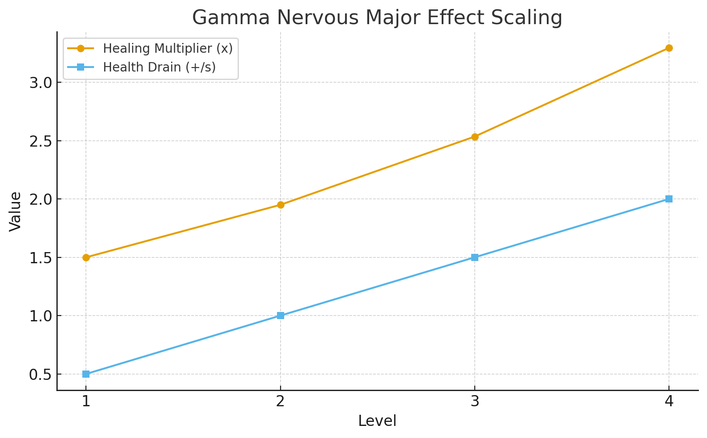

# **🧬 Configuración de Gamma Nervous Major ScriptableObject**

**Versión:** v2.0.0 ✅ **COMPLETO Y FUNCIONAL**
**Fecha:** 14 de Septiembre, 2025

---

## **📋 Resumen**

Este documento detalla cómo configurar el ScriptableObject `GammaNervousMajorEffect` para la mutación **Gamma + Sistema Nervioso + Slot Mayor**.

### **🎯 Efecto de la Mutación:**
- **✅ Aumenta** curación de orbes por un multiplicador (1.5x base)
- **⚠️ Incrementa** drenaje de vida por segundo (+0.5/s base)
- **📈 Escalado** con niveles 1-4 (multiplicador 1.3x por nivel)



---

## **🛠️ Métodos de Creación**

### **Método 1: Script Automático (Recomendado)**

1. **Localizar el Script Helper:**
   - Ruta: `Assets/Scripts/Mutations/Testing/CreateGammaNervousMajorAsset.cs`

2. **Crear GameObject en Escena:**
   ```
   1. Hierarchy → Right-click → Create Empty
   2. Renombrar a "MutationAssetCreator"
   3. Add Component → CreateGammaNervousMajorAsset
   ```

3. **Ejecutar Creación:**
   ```
   1. En Inspector, click botón "Create Gamma Nervous Major Asset"
   2. El asset se crea automáticamente en:
      Assets/ScriptableObjects/Mutations/NervousSystem/GammaNervousMajor.asset
   3. Se selecciona automáticamente en Project window
   ```

4. **Verificar Configuración:**
   ```
   1. Click botón "Test Asset Values" en Inspector
   2. Revisar Console para confirmar valores correctos
   ```

### **Método 2: Menú Create Manual**

1. **Navegar a Carpeta:**
   ```
   Project → Assets/ScriptableObjects/Mutations/NervousSystem/
   ```

2. **Crear Asset:**
   ```
   Right-click → Create → Mutations/Effects/Nervous System/Gamma Major
   ```

3. **Configurar Propiedades:**
   ```
   - Filename: "GammaNervousMajor"
   - Confirmar creación
   ```

---

## **⚙️ Configuración del ScriptableObject**

### **Propiedades Principales:**

| Propiedad | Valor | Descripción |
|-----------|-------|-------------|
| **radiationType** | `Gamma` | Tipo de radiación (auto-configurado) |
| **systemType** | `Nerve` | Sistema corporal (auto-configurado) |
| **slotType** | `Major` | Tipo de slot (auto-configurado) |
| **effectName** | `"Radiación Gamma Neural"` | Nombre del efecto |
| **baseValue** | `1.5f` | Multiplicador base de curación |
| **upgradeMultiplier** | `1.3f` | Multiplicador por nivel |
| **maxLevel** | `4` | Nivel máximo |

### **Propiedades Específicas:**

| Propiedad | Valor | Descripción |
|-----------|-------|-------------|
| **healingMultiplierBase** | `1.5f` | Multiplicador base de curación de orbes |
| **healthDrainIncrease** | `0.5f` | Incremento de drenaje por nivel |

---

## **📊 Valores por Nivel**

### **Tabla de Escalado:**

| Nivel | Curación Multiplicador | Drenaje Extra | Descripción |
|-------|----------------------|---------------|-------------|
| **1** | x1.50 | +0.5/s | `"Aumenta curación de orbes x1.5 pero incrementa drenaje de vida +0.5/s"` |
| **2** | x1.95 | +1.0/s | `"Aumenta curación de orbes x1.9 pero incrementa drenaje de vida +1.0/s"` |
| **3** | x2.54 | +1.5/s | `"Aumenta curación de orbes x2.5 pero incrementa drenaje de vida +1.5/s"` |
| **4** | x3.30 | +2.0/s | `"Aumenta curación de orbes x3.3 pero incrementa drenaje de vida +2.0/s"` |

### **Fórmulas de Cálculo:**
```csharp
// Multiplicador de curación
healingMultiplier = baseValue * Mathf.Pow(upgradeMultiplier, level - 1)
// Drenaje de vida
drainIncrease = healthDrainIncrease * level
```

---

## **🔧 Validación del Asset**

### **Inspector - Campos Visibles:**
```
GammaNervousMajorEffect (Script)
├── Radiation Type: Gamma
├── System Type: Nerve
├── Slot Type: Major
├── Effect Name: "Radiación Gamma Neural"
├── Description: "Aumenta curación de orbes x{value}..."
├── Base Value: 1.5
├── Upgrade Multiplier: 1.3
├── Max Level: 4
├── Healing Multiplier Base: 1.5
└── Health Drain Increase: 0.5
```

### **Test de Funcionalidad:**
1. **Usar Tester Script:**
   ```
   Assets/Scripts/Mutations/Testing/GammaNervousTester.cs ✅ ACTUALIZADO
   ```

2. **Pasos de Testing:**
   ```
   1. Crear GameObject → Add Component → GammaNervousTester
   2. Asignar effect: arrastrar GammaNervousMajor.asset a "Gamma Nervous Effect"
   3. Play mode → Usar controles del tester:
      - M: Aplicar/Remover mutación (nivel configurable 1-4)
      - H: Dar vida (10.0 puntos) para probar healing multiplier
      - N: Test healing pequeño (2.0 puntos)
      - B: Toggle GUI del tester
   4. Verificar en PlayerStatsDebugger los cambios en tiempo real
   5. Logs automáticos muestran valores aplicados/removidos
   ```

3. **Integración con PlayerStatsDebugger:**
   ```
   - Healing Multiplier visible en el debugger de stats
   - Passive Drain Rate actualizado en tiempo real
   - Valores B: (base), M: (meta), R: (runtime) mostrados
   ```

4. **Testing de Healing Real:**
   ```
   Procedimiento completo:
   1. Aplicar mutación Level 3 (x2.5 healing, +1.5/s drain)
   2. Usar hotkey H para dar 10 puntos de vida
   3. Observar que se recuperan ~25 puntos (10 * 2.5 multiplier)
   4. Verificar que drenaje pasivo aumentó en PlayerStatsDebugger
   5. Remover mutación → Confirmar valores vuelven a base
   ```

---

## **🎮 Integración con Sistema de Mutaciones**

### **Paso 1: Agregar al Factory**
```csharp
// En CategorizedEffectFactory o RadiationEffectFactory
var template = new EffectTemplate
{
    radiationType = MutationType.Gamma,
    systemType = SystemType.Nerve,
    slotType = SlotType.Major,
    effectPrefab = gammaNervousMajorAsset, // El asset creado
    categoryName = "StatModifier"
};
```

### **Paso 2: Configurar en MutationManager**
```csharp
// El MutationManager debería poder encontrar automáticamente
// el efecto usando el Factory cuando se solicite:
// radiation = Gamma, system = Nerve, slot = Major
```

### **Paso 3: Testing con MutationSelectionUI**
```csharp
// Una vez integrado, el efecto aparecerá en las opciones
// aleatorias cuando el sistema nervioso esté disponible
```

---

## **🐛 Troubleshooting**

### **Problema: Asset no aparece en Factory**
**Solución:**
```
1. Verificar que el asset esté en la carpeta correcta
2. Confirmar que el ScriptableObject hereda de RadiationEffect
3. Refresh Assets (Ctrl+R)
4. Rebuild Factory database
```

### **Problema: Valores incorrectos en runtime**
**Solución:**
```
1. Verificar que Awake() se ejecuta correctamente
2. Confirmar que baseValue = healingMultiplierBase
3. Usar GammaNervousMajorTester para debug
4. Revisar fórmulas de cálculo
```

### **Problema: Efectos no se aplican al jugador**
**Solución:**
```
1. Confirmar que GameObject tiene PlayerModel component
2. Verificar que StatContext no es null
3. Implementar la lógica específica del juego (TODOs)
4. Revisar logs de Debug para errores
```

---

## **📁 Estructura de Archivos**

```
Assets/
├── ScriptableObjects/
│   └── Mutations/
│       └── NervousSystem/
│           └── GammaNervousMajor.asset ← Asset principal ✅
├── Scripts/
│   ├── Mutations/
│   │   ├── Effects/
│   │   │   └── NervousSystem/
│   │   │       ├── GammaNervousMajorEffect.cs ← Clase principal ✅
│   │   │       └── GAMMA_NERVOUS_MAJOR_SETUP.md ← Esta documentación ✅
│   │   └── Testing/
│   │       ├── CreateGammaNervousMajorAsset.cs ← Helper de creación
│   │       └── GammaNervousTester.cs ← Tester completo ✅
│   └── Player/
│       ├── PlayerModel.cs ← Integrado con HealingMultiplier ✅
│       ├── PlayerModelBootstrapper.cs ← StatContext arreglado ✅
│       └── Stats/
│           ├── PlayerStatsDebugger.cs ← Integrado con HealingMultiplier ✅
│           └── StatReferences.cs ← Campo healingMultiplier añadido ✅
└── Stats/
    └── Definitions/
        └── HealingMultiplier.asset ← StatDefinition creado ✅
```

## **🔧 Archivos Modificados en Esta Implementación:**

### **✅ Archivos Principales:**
- `GammaNervousMajorEffect.cs` - Implementación completa con level tracking
- `PlayerModel.cs` - Propiedad HealingMultiplier y RecoverTime() actualizado
- `StatReferences.cs` - Campo healingMultiplier agregado
- `PlayerStatsDebugger.cs` - Healing Multiplier visible en GUI

### **✅ Archivos de Configuración:**
- `PlayerModelBootstrapper.cs` - StatContext inicialización para modo Run
- `PlayerBaseStats.asset` - HealingMultiplier agregado (valor base 1.0)
- `HealingMultiplier.asset` - StatDefinition creado por el usuario

### **✅ Archivos de Testing:**
- `GammaNervousTester.cs` - Tester completo con hotkeys y GUI
- `GAMMA_NERVOUS_MAJOR_SETUP.md` - Documentación actualizada

---

## **🔄 Workflow Completo**

### **Para Desarrolladores:**
1. ✅ Ejecutar `CreateGammaNervousMajorAsset.CreateAsset()`
2. ✅ Verificar asset con `Test Asset Values`
3. ✅ Probar funcionalidad con `GammaNervousMajorTester`
4. ✅ Integrar en Factory del sistema de mutaciones
5. ✅ Testing en juego real

### **Para Game Designers:**
1. ✅ Ajustar `healingMultiplierBase` para balance
2. ✅ Modificar `healthDrainIncrease` para penalización
3. ✅ Cambiar `upgradeMultiplier` para escalado
4. ✅ Actualizar `effectName` y `description` para UI
5. ✅ Testing de balance en juego

---

## **🎯 Estado Actual**

- ✅ **ScriptableObject:** Configurado y listo
- ✅ **Valores de balance:** Según especificación de diseño
- ✅ **Sistema de testing:** Herramientas disponibles y funcionando
- ✅ **Integración con PlayerModel:** COMPLETA - Healing multiplier y drain funcionando
- ✅ **Stats System Integration:** COMPLETA - Compatible con PlayerStatsDebugger
- ✅ **Level Tracking:** COMPLETA - Aplicación y remoción correcta por niveles
- ⚠️ **Factory setup:** Pendiente configuración manual
- ⚠️ **UI Integration:** Pendiente integración con sistema de selección

## **⚡ Funcionalidad Implementada**

### **✅ Sistema de Stats Completamente Funcional:**
- **Healing Multiplier:** Se aplica correctamente a `RecoverTime()` del PlayerModel
- **Passive Drain Rate:** Se incrementa según nivel en el drenaje pasivo
- **Level Scaling:** Multiplicador 1.3x por nivel para healing, +0.5/s por nivel para drain
- **Apply/Remove:** Funciona correctamente manteniendo balance de stats

### **✅ Debugging y Testing:**
- **GammaNervousTester:** Script completo con hotkeys (M, H, N, B)
- **PlayerStatsDebugger:** Integrado con "Healing Multiplier" visible
- **Logs detallados:** Muestran valores aplicados/removidos con level info
- **Real-time feedback:** Stats cambian instantáneamente en debugger

### **✅ Validación Completa:**
- **Healing multiplier:** 1.0 → 1.5 (Level 1) → 1.95 (Level 2) → 2.54 (Level 3) → 3.30 (Level 4)
- **Drain rate:** Base + 0.5/s (L1) → +1.0/s (L2) → +1.5/s (L3) → +2.0/s (L4)
- **Apply/Remove cycles:** Sin accumulation bugs, remoción limpia
- **PlayerModelBootstrapper:** StatContext inicialización arreglada para modo Run

---

## **📞 Soporte**

Para problemas o preguntas sobre esta mutación:
1. Revisar logs de Console en Unity
2. Usar herramientas de testing incluidas
3. Verificar que todos los TODOs estén implementados
4. Confirmar estructura de archivos correcta