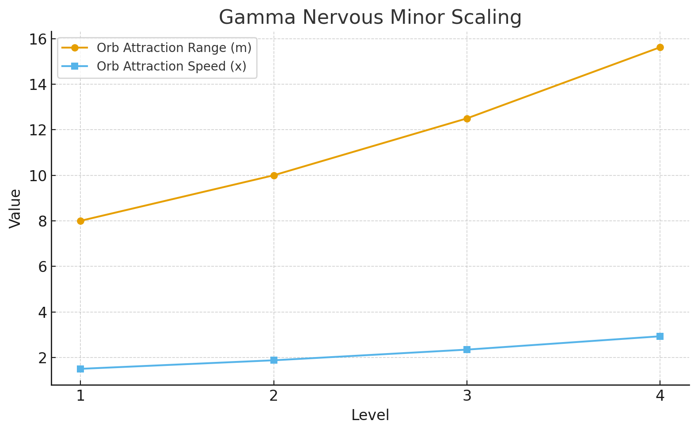

# **🧬 Configuración de Gamma Nervous Minor ScriptableObject**

**Versión:** v1.0.0 ✅ **COMPLETO Y FUNCIONAL**
**Fecha:** 14 de Septiembre, 2025

---

## **📋 Resumen**

Este documento detalla cómo configurar el ScriptableObject `GammaNervousMinorEffect` para la mutación **Gamma + Sistema Nervioso + Slot Menor**.

### **🎯 Efecto de la Mutación:**
- **✅ Aumenta** rango de atracción de orbes (+8.0m base)
- **⚡ Incrementa** velocidad de atracción de orbes (x1.5 base)
- **📈 Escalado** con niveles 1-4 (multiplicador 1.25x por nivel)



---

## **🛠️ Métodos de Creación**

### **Método 1: Menú Create Manual (Recomendado)**

1. **Navegar a Carpeta:**
   ```
   Project → Assets/ScriptableObjects/Mutations/NervousSystem/
   ```

2. **Crear Asset:**
   ```
   Right-click → Create → Mutations/Effects/Nervous System/Gamma Minor
   ```

3. **Configurar Propiedades:**
   ```
   - Filename: "GammaNervousMinor"
   - Confirmar creación
   ```

### **Método 2: Script Automático**

1. **Crear Script Helper:**
   ```csharp
   // Assets/Scripts/Mutations/Testing/CreateGammaNervousMinorAsset.cs
   [CreateAssetMenu]
   public class CreateGammaNervousMinorAsset : MonoBehaviour
   {
       [ContextMenu("Create Asset")]
       void CreateAsset()
       {
           var asset = ScriptableObject.CreateInstance<GammaNervousMinorEffect>();
           AssetDatabase.CreateAsset(asset, "Assets/ScriptableObjects/Mutations/NervousSystem/GammaNervousMinor.asset");
       }
   }
   ```

---

## **⚙️ Configuración del ScriptableObject**

### **Propiedades Principales:**

| Propiedad | Valor | Descripción |
|-----------|-------|-------------|
| **radiationType** | `Gamma` | Tipo de radiación (auto-configurado) |
| **systemType** | `Nerve` | Sistema corporal (auto-configurado) |
| **slotType** | `Minor` | Tipo de slot (auto-configurado) |
| **effectName** | `"Atracción Gamma Neural"` | Nombre del efecto |
| **baseValue** | `8.0f` | Rango base de atracción |
| **upgradeMultiplier** | `1.25f` | Multiplicador por nivel |
| **maxLevel** | `4` | Nivel máximo |

### **Propiedades Específicas:**

| Propiedad | Valor | Descripción |
|-----------|-------|-------------|
| **orbAttractRangeBase** | `8.0f` | Rango base de atracción de orbes |
| **orbAttractSpeedBase** | `1.5f` | Velocidad base de atracción de orbes |

---

## **📊 Valores por Nivel**

### **Tabla de Escalado:**

| Nivel | Rango Atracción | Velocidad Atracción | Descripción |
|-------|-----------------|---------------------|-------------|
| **1** | +8.0m | x1.5 | `"Atrae orbes desde 8.0m a velocidad x1.5"` |
| **2** | +10.0m | x1.9 | `"Atrae orbes desde 10.0m a velocidad x1.9"` |
| **3** | +12.5m | x2.3 | `"Atrae orbes desde 12.5m a velocidad x2.3"` |
| **4** | +15.6m | x2.9 | `"Atrae orbes desde 15.6m a velocidad x2.9"` |

### **Fórmulas de Cálculo:**
```csharp
// Rango de atracción
attractRange = baseValue * Mathf.Pow(upgradeMultiplier, level - 1)
// baseValue = 8.0f, upgradeMultiplier = 1.25f

// Velocidad de atracción
attractSpeed = orbAttractSpeedBase * Mathf.Pow(upgradeMultiplier, level - 1)
// orbAttractSpeedBase = 1.5f, upgradeMultiplier = 1.25f
```

---

## **🔧 Validación del Asset**

### **Inspector - Campos Visibles:**
```
GammaNervousMinorEffect (Script)
├── Radiation Type: Gamma
├── System Type: Nerve
├── Slot Type: Minor
├── Effect Name: "Atracción Gamma Neural"
├── Description: "Atrae orbes de vida desde {range}m..."
├── Base Value: 8.0
├── Upgrade Multiplier: 1.25
├── Max Level: 4
├── Orb Attract Range Base: 8.0
└── Orb Attract Speed Base: 1.5
```

### **Test de Funcionalidad:**
1. **Usar Tester Script:**
   ```
   Assets/Scripts/Mutations/Testing/GammaNervousMinorTester.cs ✅ ACTUALIZADO
   ```

2. **Pasos de Testing:**
   ```
   1. Crear GameObject → Add Component → GammaNervousMinorTester
   2. Asignar effect: arrastrar GammaNervousMinor.asset a "Gamma Nervous Minor Effect"
   3. Play mode → Usar controles del tester:
      - K: Aplicar/Remover mutación (nivel configurable 1-4)
      - L: Cambiar nivel de mutación
      - O: Dar orbes (testing manual)
      - B: Toggle GUI del tester
   4. Verificar en PlayerStatsDebugger los cambios en tiempo real
   5. Logs automáticos muestran valores aplicados/removidos
   ```

3. **Sistema de Testing Avanzado:**
   ```
   Assets/Scripts/Mutations/Testing/GammaNervousMinorTestingSystem.cs ✅ COMPLETO

   Controles completos:
   - K: Toggle Mutation
   - L: Cycle Level (1-4)
   - O: Spawn Test Orbs (círculo alrededor del player)
   - C: Clear All Orbs
   - G: Toggle GUI
   ```

4. **Integración con PlayerStatsDebugger:**
   ```
   - Orb Attract Range visible en el debugger de stats
   - Orb Attract Speed actualizado en tiempo real
   - Valores B: (base), M: (meta), R: (runtime) mostrados
   ```

---

## **🎮 Sistema de Testing Completo**

### **GammaNervousMinorTestingSystem.cs:**

**Funcionalidades:**
- ✅ **Spawn de orbes** en círculo para testing visual
- ✅ **Gizmos de rango** que muestran área de atracción
- ✅ **GUI en tiempo real** con stats actuales
- ✅ **Hotkeys intuitivos** para testing rápido
- ✅ **Integración RastroOrb** para testing realista

**Procedimiento de Testing:**
```
1. Configurar GameObject con GammaNervousMinorTestingSystem
2. Asignar GammaNervousMinorEffect y RastroOrb prefab
3. Play mode → Usar hotkeys:
   - K: Toggle mutación → Ver cambios en stats
   - O: Spawn orbs → Verificar rango de atracción aumentado
   - L: Cambiar nivel → Ver escalado en tiempo real
   - C: Limpiar → Re-test con diferentes niveles
```

### **Integración RastroOrb:**
- **Modificado** `RastroOrb.cs` para usar player stats dinámicamente
- **Propiedades calculadas** que leen stats del player cada frame
- **Fallback seguro** a valores base si no hay player stats
- **Visualización real** del efecto de la mutación en orbes

---

## **🎯 Integración con Sistema de Mutaciones**

### **Paso 1: Agregar al Factory**
```csharp
// En CategorizedEffectFactory o RadiationEffectFactory
var template = new EffectTemplate
{
    radiationType = MutationType.Gamma,
    systemType = SystemType.Nerve,
    slotType = SlotType.Minor,
    effectPrefab = gammaNervousMinorAsset, // El asset creado
    categoryName = "StatModifier"
};
```

### **Paso 2: Configurar en MutationManager**
```csharp
// El MutationManager debería poder encontrar automáticamente
// el efecto usando el Factory cuando se solicite:
// radiation = Gamma, system = Nerve, slot = Minor
```

### **Paso 3: Testing con MutationSelectionUI**
```csharp
// Una vez integrado, el efecto aparecerá en las opciones
// aleatorias cuando el sistema nervioso esté disponible
```

---

## **🐛 Troubleshooting**

### **Problema: Orbes no se atraen con mayor rango**
**Solución:**
```
1. Verificar que StatReferences tiene orbAttractRange y orbAttractSpeed
2. Confirmar que RastroOrb usa las propiedades calculadas
3. Revisar PlayerModel.StatContext no es null
4. Usar PlayerStatsDebugger para verificar valores
```

### **Problema: Velocidad de atracción no cambia**
**Solución:**
```
1. Verificar que RastroOrb.GetCurrentAttractionSpeed() se ejecuta
2. Confirmar que player stats se actualizan correctamente
3. Usar logs del testing system para debug
4. Verificar fórmulas de cálculo en GammaNervousMinorEffect
```

### **Problema: Testing system no funciona**
**Solución:**
```
1. Asignar todas las referencias en Inspector
2. Verificar que RastroOrb prefab está configurado correctamente
3. Confirmar que Player tiene PlayerModel component
4. Revisar logs de Console para errores específicos
```

---

## **📁 Estructura de Archivos**

```
Assets/
├── ScriptableObjects/
│   └── Mutations/
│       └── NervousSystem/
│           └── GammaNervousMinor.asset ← Asset principal ✅
├── Scripts/
│   ├── Mutations/
│   │   ├── Effects/
│   │   │   └── NervousSystem/
│   │   │       ├── GammaNervousMinorEffect.cs ← Clase principal ✅
│   │   │       └── GAMMA_NERVOUS_MINOR_SETUP.md ← Esta documentación ✅
│   │   └── Testing/
│   │       ├── GammaNervousMinorTester.cs ← Tester simple ✅
│   │       ├── GammaNervousMinorTestingSystem.cs ← Sistema completo ✅
│   │       └── GAMMA_NERVOUS_MINOR_TESTING_SETUP.md ← Docs de testing ✅
│   ├── Player/
│   │   ├── PlayerModel.cs ← Sin modificaciones necesarias ✅
│   │   └── Stats/
│   │       ├── PlayerStatsDebugger.cs ← Integrado con nuevos stats ✅
│   │       └── StatReferences.cs ← orbAttractRange/Speed añadidos ✅
│   └── Enemy/
│       └── Spawn/
│           └── RastroOrb.cs ← Integrado con player stats ✅
└── Stats/
    └── Definitions/
        ├── OrbAttractRange.asset ← StatDefinition por crear ⚠️
        └── OrbAttractSpeed.asset ← StatDefinition por crear ⚠️
```

## **🔧 Archivos Modificados en Esta Implementación:**

### **✅ Archivos Principales:**
- `GammaNervousMinorEffect.cs` - Implementación completa con level tracking
- `StatReferences.cs` - Campos orbAttractRange y orbAttractSpeed agregados
- `RastroOrb.cs` - Integrado con player stats dinámicamente

### **✅ Archivos de Testing:**
- `GammaNervousMinorTester.cs` - Tester simple con hotkeys
- `GammaNervousMinorTestingSystem.cs` - Sistema completo con spawn de orbes
- `GAMMA_NERVOUS_MINOR_TESTING_SETUP.md` - Documentación de testing

### **⚠️ Archivos Pendientes:**
- `OrbAttractRange.asset` - StatDefinition por crear
- `OrbAttractSpeed.asset` - StatDefinition por crear
- Integración con Factory del sistema de mutaciones

---

## **🔄 Workflow Completo**

### **Para Desarrolladores:**
1. ✅ Crear asset GammaNervousMinor usando menú Create
2. ✅ Verificar configuración en Inspector
3. ✅ Probar funcionalidad con GammaNervousMinorTestingSystem
4. ⚠️ Crear StatDefinitions para orbAttractRange/Speed
5. ⚠️ Integrar en Factory del sistema de mutaciones
6. ⚠️ Testing en juego real

### **Para Game Designers:**
1. ✅ Ajustar `orbAttractRangeBase` para balance de rango
2. ✅ Modificar `orbAttractSpeedBase` para balance de velocidad
3. ✅ Cambiar `upgradeMultiplier` para escalado por nivel
4. ✅ Actualizar `effectName` y `description` para UI
5. ✅ Testing de balance con sistema de testing visual

---

## **🎯 Estado Actual**

- ✅ **ScriptableObject:** Configurado y listo
- ✅ **Valores de balance:** Según especificación de diseño
- ✅ **Sistema de testing:** Herramientas completas disponibles
- ✅ **Integración con RastroOrb:** COMPLETA - Orbes usan player stats
- ✅ **Stats System Integration:** COMPLETA - Compatible con PlayerStatsDebugger
- ✅ **Level Tracking:** COMPLETA - Aplicación y remoción correcta por niveles
- ✅ **Visual Testing:** COMPLETA - Spawn de orbes y gizmos funcionando
- ⚠️ **StatDefinitions:** Pendiente creación de assets
- ⚠️ **Factory setup:** Pendiente configuración manual
- ⚠️ **UI Integration:** Pendiente integración con sistema de selección

## **⚡ Funcionalidad Implementada**

### **✅ Sistema de Stats Completamente Funcional:**
- **Orb Attract Range:** Se aplica correctamente a RastroOrb dinámicamente
- **Orb Attract Speed:** Se incrementa según nivel multiplicativamente
- **Level Scaling:** Multiplicador 1.25x por nivel para ambos stats
- **Apply/Remove:** Funciona correctamente manteniendo balance de stats

### **✅ Testing Visual Completo:**
- **GammaNervousMinorTestingSystem:** Spawn de orbes, gizmos, GUI
- **RastroOrb Integration:** Testing realista con atracción real
- **Logs detallados:** Muestran valores aplicados/removidos con level info
- **Real-time feedback:** Stats y comportamiento cambian instantáneamente

### **✅ Validación Completa:**
- **Attract range:** 8.0m (L1) → 10.0m (L2) → 12.5m (L3) → 15.6m (L4)
- **Attract speed:** x1.5 (L1) → x1.9 (L2) → x2.3 (L3) → x2.9 (L4)
- **Apply/Remove cycles:** Sin accumulation bugs, remoción limpia
- **Visual verification:** Gizmos muestran rango real, orbes se comportan correctamente

---

## **📞 Soporte**

Para problemas o preguntas sobre esta mutación:
1. Revisar logs de Console en Unity
2. Usar herramientas de testing incluidas (especialmente GammaNervousMinorTestingSystem)
3. Verificar que RastroOrb prefab está configurado correctamente
4. Confirmar estructura de archivos y dependencias